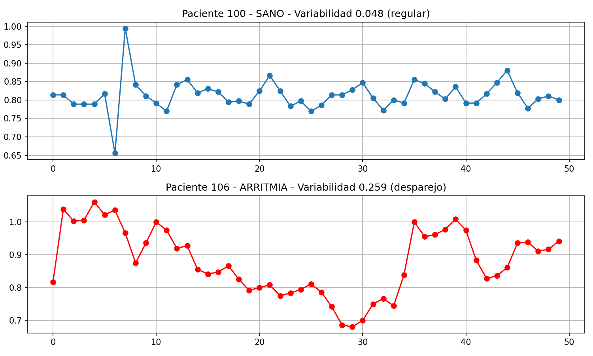

# Detector de Arritmias con Python - MIT-BIH

Analicé señales ECG reales de la base de datos MIT-BIH Arrhythmia Database.

### Método
1. Leí los registros 100 (sano) y 106 (arritmia) con `wfdb`
2. Detecté latidos con `scipy.signal.find_peaks`
3. Calculé intervalos RR y su variabilidad (desviación estándar)

### Resultados
- **Paciente 100 SANO: 0.048s** -> Ritmo regular, casi una línea recta
- **Paciente 106 ARRITMIA: 0.259s** -> 5x más variabilidad, ritmo desparejo
- Regla: Si variabilidad > 0.2 => ARRITMIA

### Tecnologías
Python, wfdb, numpy, matplotlib, scipy

Autor: Marcelo Dominguez - Proyecto de portfolio
